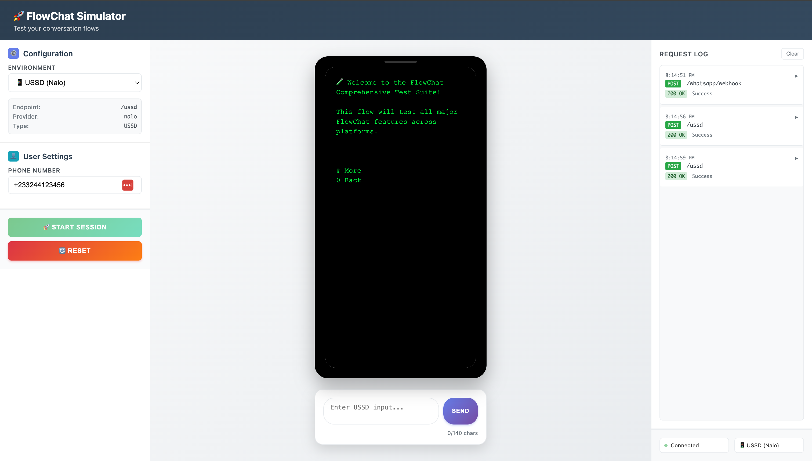

# FlowChat

[](https://github.com/radioactive-labs/flow_chat/actions/workflows/ci.yml)
[](https://badge.fury.io/rb/flow_chat)
[](https://opensource.org/licenses/MIT)
[](https://www.ruby-lang.org/)
[](https://rubyonrails.org/)

FlowChat is a Rails framework for building sophisticated conversational workflows for USSD and WhatsApp messaging. Define multi-step conversations as Ruby classes with automatic session management, input validation, and cross-platform compatibility.

## Key Features

- 🎯 **Declarative Flow Definition** - Define conversations as Ruby classes
- 🔄 **Automatic Session Management** - Persistent state across requests  
- ✅ **Input Validation & Transformation** - Built-in validation and data conversion
- 📱 **USSD & WhatsApp Support** - Single codebase, multiple platforms
- 💬 **Rich WhatsApp Features** - Interactive buttons, lists, media support
- 🔧 **Standalone WhatsApp Client** - Send messages outside of flows
- 📊 **Built-in Instrumentation** - Monitoring and metrics out of the box
- 🧪 **Testing Tools** - Built-in simulator for development and testing

## Installation

Add to your Gemfile:

```ruby
gem 'flow_chat'
```

Then run:

```bash
bundle install
```

## Quick Start

### USSD Example

Create a flow in `app/flow_chat/welcome_flow.rb`:

```ruby
class WelcomeFlow < FlowChat::Flow
  def main_page
    name = app.screen(:name) do |prompt|
      prompt.ask "What's your name?",
        transform: ->(input) { input.strip.titleize }
    end

    language = app.screen(:language) do |prompt|
      prompt.select "Choose language:", ["English", "French", "Spanish"]
    end

    app.say "Hello #{name}! Language set to #{language}."
  end
end
```

Create a controller:

```ruby
class UssdController < ApplicationController
  skip_forgery_protection

  def process_request
    processor = FlowChat::Ussd::Processor.new(self) do |config|
      config.use_gateway FlowChat::Ussd::Gateway::Nalo
      config.use_session_store FlowChat::Session::CacheSessionStore
    end

    processor.run WelcomeFlow, :main_page
  end
end
```

Add route in `config/routes.rb`:

```ruby
  post 'ussd' => 'ussd#process_request'
```

### WhatsApp Example

Configure credentials in `config/credentials.yml.enc`:

```yaml
whatsapp:
  access_token: "your_access_token"
  phone_number_id: "your_phone_number_id"
  verify_token: "your_verify_token"
  app_secret: "your_app_secret"
```

Create a controller:

```ruby
class WhatsappController < ApplicationController
  skip_forgery_protection

  def webhook
    processor = FlowChat::Whatsapp::Processor.new(self) do |config|
      config.use_gateway FlowChat::Whatsapp::Gateway::CloudApi
      config.use_session_store FlowChat::Session::CacheSessionStore
    end

    processor.run WelcomeFlow, :main_page
  end
end
```

Add route:

```ruby
  match '/whatsapp/webhook', to: 'whatsapp#webhook', via: [:get, :post]
```

## Core Concepts

### Flows and Screens

**Flows** define conversation logic. **Screens** collect user input with automatic validation:

```ruby
class RegistrationFlow < FlowChat::Flow
  def main_page
email = app.screen(:email) do |prompt|
      prompt.ask "Enter email:",
        validate: ->(input) { "Invalid email" unless input.include?("@") },
        transform: ->(input) { input.downcase.strip }
    end

confirmed = app.screen(:confirm) do |prompt|
      prompt.yes? "Create account for #{email}?"
end

if confirmed
      create_account(email)
      app.say "Account created successfully!"
    else
      app.say "Registration cancelled."
    end
  end
end
```

### Input Methods

- **`prompt.ask()`** - Free-form input with optional validation
- **`prompt.select()`** - Force selection from predefined options  
- **`prompt.yes?()`** - Simple yes/no questions

## WhatsApp Client

Send messages outside of flows:

```ruby
config = FlowChat::Whatsapp::Configuration.from_credentials
client = FlowChat::Whatsapp::Client.new(config)

# Send messages
client.send_text("+1234567890", "Hello!")
client.send_buttons("+1234567890", "Choose:", [
  { id: 'option1', title: 'Option 1' },
  { id: 'option2', title: 'Option 2' }
])
```

## Testing Simulator

FlowChat includes a powerful built-in simulator with a modern web interface for testing both USSD and WhatsApp flows:



Features:
- 📱 **Visual Interface** - Phone-like display with real conversation flow
- 🔄 **Environment Switching** - Toggle between USSD and WhatsApp modes
- 📊 **Request Logging** - Real-time HTTP request/response monitoring
- 🎯 **Interactive Testing** - Test flows with character counting and validation
- 🛠️ **Developer Tools** - Session management and connection status

See the [Testing Guide](docs/testing.md) for complete setup instructions and testing strategies.


## Documentation

- **[WhatsApp Setup](docs/whatsapp-setup.md)** - Comprehensive WhatsApp configuration
- **[USSD Setup](docs/ussd-setup.md)** - USSD gateway configuration and examples
- **[Flow Development](docs/flows.md)** - Advanced flow patterns and techniques
- **[Media Support](docs/media.md)** - Rich media handling for WhatsApp
- **[Testing Guide](docs/testing.md)** - Complete testing strategies
- **[Configuration Reference](docs/configuration.md)** - All configuration options
- **[Instrumentation](docs/instrumentation.md)** - Monitoring and metrics
- **[Security](docs/security.md)** - Security best practices
- **[Examples](examples/)** - Complete working examples

## Examples

See the [examples directory](examples/) for complete implementations:

- **[USSD Controller](examples/ussd_controller.rb)** - Full USSD implementation
- **[WhatsApp Controller](examples/whatsapp_controller.rb)** - Basic WhatsApp setup
- **[Multi-tenant WhatsApp](examples/multi_tenant_whatsapp_controller.rb)** - Advanced WhatsApp
- **[Background Jobs](examples/whatsapp_message_job.rb)** - Async message processing
- **[Simulator Controller](examples/simulator_controller.rb)** - Testing setup

## License

The gem is available as open source under the terms of the [MIT License](https://opensource.org/licenses/MIT).
