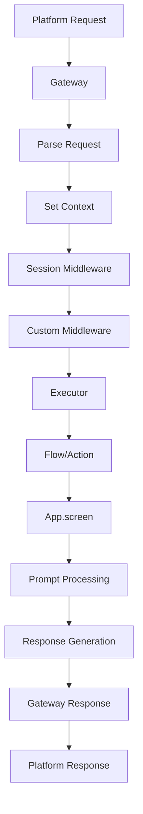

# FlowChat Architecture

FlowChat is built around a **composition-based architecture** with **pluggable gateways** that enables unified conversational interfaces across multiple platforms. This document explains the core architectural decisions and how they enable FlowChat's flexibility.

## Design Principles

### 1. Platform Abstraction

FlowChat abstracts platform differences through a unified API, allowing the same flow code to work across USSD, WhatsApp, HTTP, and custom platforms.

```ruby
# This exact code works on ALL platforms
def survey_flow
  name = app.screen(:name) { |p| p.ask "What's your name?" }
  rating = app.screen(:rating) { |p| p.select "Rate us:", ["1", "2", "3", "4", "5"] }
  app.say "Thanks #{name}! You rated us #{rating}/5"
end
```

### 2. Composition Over Inheritance

Rather than platform-specific classes, FlowChat uses composition to configure behavior:

```ruby
# Old approach (inheritance) - DEPRECATED
class UssdApp < FlowChat::BaseApp; end
class WhatsappApp < FlowChat::BaseApp; end

# New approach (composition) - CURRENT
processor = FlowChat::Processor.new(self) do |config|
  config.use_gateway FlowChat::Ussd::Gateway::Nalo        # Platform behavior
  config.use_session_store FlowChat::Session::RailsSessionStore  # Session behavior
  config.use_middleware CustomLoggingMiddleware           # Custom behavior
end
```

### 3. Pluggable Gateways

Each platform can have multiple gateway implementations, making FlowChat extensible:

```ruby
# Built-in USSD gateway
config.use_gateway FlowChat::Ussd::Gateway::Nalo

# Example custom USSD gateways (you would build these)
config.use_gateway YourCompany::Ussd::Gateway::Africaist
config.use_gateway YourCompany::Ussd::Gateway::MTN

# Built-in WhatsApp gateway
config.use_gateway FlowChat::Whatsapp::Gateway::CloudApi

# Example custom WhatsApp gateways (you would build these)
config.use_gateway YourCompany::Whatsapp::Gateway::OnPremise
config.use_gateway YourCompany::Whatsapp::Gateway::Twilio

# Example custom platforms (you would build these)
config.use_gateway YourCompany::Sms::Gateway::Twilio
config.use_gateway YourCompany::Voice::Gateway::Plivo
config.use_gateway YourCompany::Slack::Gateway::BoltJS
```

## Core Components

### Processor

The `FlowChat::Processor` is the central orchestrator that builds and executes the middleware stack.

```ruby
processor = FlowChat::Processor.new(controller) do |config|
  config.use_gateway GatewayClass, *gateway_args
  config.use_session_store SessionStoreClass
  config.use_middleware CustomMiddleware
  config.use_session_config(boundaries: [:flow], identifier: :msisdn)
end

processor.run FlowClass, :action_method
```

**Responsibilities:**
- Build middleware stack based on configuration
- Manage session configuration
- Coordinate gateway and middleware interaction
- Handle errors and instrumentation

### Gateway

Gateways handle platform-specific request parsing and response rendering.

```ruby
class MyCustomGateway
  def initialize(app, *config_args)
    @app = app
    @config = config_args.first
  end

  def call(context)
    # 1. Parse platform-specific request
    context["request.msisdn"] = extract_phone_number(request)
    context["request.platform"] = :my_platform
    context.input = extract_user_input(request)
    
    # 2. Process through middleware stack
    type, prompt, choices, media = @app.call(context)
    
    # 3. Render platform-specific response
    send_platform_response(type, prompt, choices, media)
  end

  # Optional: Configure platform-specific middleware
  def self.configure_middleware_stack(builder, custom_middleware)
    builder.use MyPlatform::SpecialMiddleware
    builder.use custom_middleware
    builder.use MyPlatform::ResponseMiddleware
  end
end
```

**Gateway Interface:**
- `initialize(app, *args)` - Set up gateway with app and config
- `call(context)` - Process request through middleware stack
- `self.configure_middleware_stack(builder, custom_middleware)` - Optional middleware configuration

### App

The `FlowChat::App` provides the unified interface that flows use to interact with users.

```ruby
class FlowChat::App
  def screen(key, &block)
    # Automatic state management and navigation
  end
  
  def say(message, media: nil)
    # Platform-appropriate message sending
  end
  
  # Context accessors that work across platforms
  def msisdn, user_id, platform, gateway
  def message_id, timestamp, contact_name, location, media
end
```

**Key Features:**
- **Screen-based navigation** with automatic state management
- **Platform-agnostic prompts** that adapt to each platform's capabilities
- **Consistent context** regardless of underlying platform
- **Session integration** for data persistence

### Session

Session management with configurable boundaries and storage backends.

```ruby
# Session boundaries control session ID generation
config.use_session_config(
  boundaries: [:flow, :platform, :gateway, :url],  # Session isolation
  identifier: :msisdn,                              # Session key type
  hash_identifiers: true                            # Privacy protection
)

# Session stores control where data is stored
config.use_session_store FlowChat::Session::RailsSessionStore     # Rails sessions
config.use_session_store FlowChat::Session::CacheSessionStore    # Rails cache
config.use_session_store YourCompany::Session::DatabaseStore     # Custom store
```

### Middleware

Extensible processing pipeline for custom logic.

```ruby
class CustomMiddleware
  def initialize(app)
    @app = app
  end
  
  def call(context)
    # Before processing
    log_request(context)
    
    # Process through stack
    result = @app.call(context)
    
    # After processing  
    log_response(context, result)
    
    result
  end
end
```

## Request Processing Flow

Here's how a request flows through FlowChat:



### Detailed Flow

1. **Request Arrives** at platform (USSD, WhatsApp, HTTP)
2. **Gateway** parses platform-specific request format
3. **Context Setup** with normalized request data
4. **Session Middleware** manages session state and boundaries
5. **Custom Middleware** processes business logic
6. **Executor** instantiates and calls flow
7. **Flow Method** uses `app.screen()` for conversation logic
8. **Prompt Processing** handles user input and validation
9. **Response Generation** creates platform-agnostic response
10. **Gateway Rendering** converts to platform-specific format
11. **Platform Response** sent back to user

## Middleware Stack

The middleware stack is built dynamically based on gateway capabilities:

```ruby
def create_middleware_stack
  ::Middleware::Builder.new(name: @gateway_class.name) do |b|
    # Gateway always comes first
    b.use @gateway_class, *@gateway_args
    
    # Session middleware sets up session boundaries
    b.use FlowChat::Session::Middleware, @session_options

    # Platform-specific middleware (if gateway supports it)
    if @gateway_class.respond_to?(:configure_middleware_stack)
      @gateway_class.configure_middleware_stack(b, custom_middleware)
    else
      b.use custom_middleware
    end

    # Executor always goes last
    b.use FlowChat::Executor
  end
end
```

### Platform-Specific Middleware

Gateways can configure their own middleware stack:

```ruby
class FlowChat::Ussd::Gateway::Nalo
  def self.configure_middleware_stack(builder, custom_middleware)
    builder.use FlowChat::Ussd::Middleware::Pagination
    builder.use custom_middleware
    builder.use FlowChat::Ussd::Middleware::ChoiceMapper
  end
end

class FlowChat::Whatsapp::Gateway::CloudApi
  def self.configure_middleware_stack(builder, custom_middleware)
    builder.use FlowChat::Whatsapp::Middleware::MediaProcessor
    builder.use custom_middleware
    builder.use FlowChat::Whatsapp::Middleware::TemplateRenderer
  end
end
```

## Session Architecture

### Session ID Generation

Session IDs are generated based on configurable boundaries:

```ruby
# Example session IDs based on boundaries
boundaries: [:flow]                    # => "survey_flow:user123"
boundaries: [:flow, :platform]        # => "survey_flow:ussd:user123"  
boundaries: [:flow, :platform, :gateway] # => "survey_flow:ussd:nalo:user123"
boundaries: [:flow, :url]              # => "survey_flow:tenant1.app.com:user123"
```

### Session Stores

Different storage backends for different use cases:

```ruby
# Rails sessions (shorter-lived, good for testing)
FlowChat::Session::RailsSessionStore

# Rails cache (longer-lived, good for production)
FlowChat::Session::CacheSessionStore  

# Custom database store (permanent storage)
class CustomDatabaseStore
  def initialize(context)
    @context = context
  end
  
  def get(key)
    SessionData.find_by(session_id: @context["session.id"], key: key)&.value
  end
  
  def set(key, value)
    SessionData.upsert({
      session_id: @context["session.id"],
      key: key,
      value: value
    })
  end
end
```

## Extensibility Points

FlowChat provides multiple extension points:

### 1. Custom Gateways

Implement any platform by creating a gateway:

```ruby
class YourCompany::Telegram::Gateway::BotAPI
  def initialize(app, bot_token)
    @app = app
    @bot_token = bot_token
  end

  def call(context)
    # Parse Telegram webhook
    update = JSON.parse(context.controller.request.body.read)
    message = update.dig("message")
    
    context["request.user_id"] = message["from"]["id"]
    context["request.platform"] = :telegram
    context.input = message["text"]
    
    # Process through stack
    type, prompt, choices, media = @app.call(context)
    
    # Send response via Telegram API
    send_telegram_message(prompt, to: context["request.user_id"])
  end
end
```

### 2. Custom Middleware

Add processing logic at any point:

```ruby
class AuthenticationMiddleware
  def call(context)
    user = authenticate_user(context["request.user_id"])
    context["current_user"] = user
    @app.call(context)
  end
end

class RateLimitingMiddleware
  def call(context)
    check_rate_limit(context["request.user_id"])
    @app.call(context)
  end
end
```

### 3. Custom Session Stores

Implement any storage backend:

```ruby
class RedisSessionStore
  def get(key)
    Redis.current.hget(session_key, key)
  end
  
  def set(key, value)
    Redis.current.hset(session_key, key, value)
    Redis.current.expire(session_key, 24.hours.to_i)
  end
end
```

### 4. Custom Renderers

Platform-specific rendering logic:

```ruby
class MyPlatform::Renderer
  def initialize(prompt, choices: nil, media: nil)
    @prompt = prompt
    @choices = choices
    @media = media
  end
  
  def render
    {
      text: transform_text(@prompt),
      buttons: transform_choices(@choices),
      attachments: transform_media(@media)
    }
  end
end
```

## Configuration Architecture

FlowChat uses a flexible configuration system:

```ruby
# Global configuration
FlowChat::Config.logger = Rails.logger
FlowChat::Config.cache = Rails.cache

# Platform-specific configuration
FlowChat::Config.ussd.pagination_page_size = 160
FlowChat::Config.whatsapp.message_handling_mode = :background

# Per-processor configuration
processor = FlowChat::Processor.new(self) do |config|
  config.use_gateway GatewayClass, gateway_config
  config.use_session_config(boundaries: [:flow], identifier: :user_id)
  config.use_middleware CustomMiddleware
end
```

## Error Handling & Instrumentation

FlowChat includes comprehensive error handling and instrumentation:

```ruby
# Instrumentation events
FlowChat.instrument(Events::MESSAGE_RECEIVED, {
  from: user_id,
  message: input,
  platform: :ussd
})

FlowChat.instrument(Events::FLOW_EXECUTION_START, {
  flow_name: "survey_flow",
  action: "start"
})

# Error handling in flows
def payment_flow
  begin
    process_payment(amount)
  rescue PaymentError => e
    app.say "Payment failed: #{e.message}"
    FlowChat.instrument(Events::PAYMENT_FAILED, {
      error: e.message,
      user_id: app.user_id
    })
  end
end
```

## Performance Considerations

### Memory Efficiency

- **Stateless design**: No application state stored in memory
- **Session isolation**: Users don't affect each other
- **Lazy loading**: Components loaded only when needed

### Scalability

- **Horizontal scaling**: Each request is independent
- **Background processing**: Long-running tasks handled asynchronously
- **Caching**: Session data cached for performance

### Network Efficiency

- **Platform optimization**: Each gateway optimizes for its platform
- **Compression**: Large responses automatically paginated (USSD)
- **Batching**: Multiple messages combined when possible (WhatsApp)

## Security

### Session Security

- **Identifier hashing**: Phone numbers hashed by default
- **Session boundaries**: Prevent cross-tenant data access
- **Secure storage**: Session stores can encrypt data

### Input Validation

- **Automatic sanitization**: User input sanitized by default
- **Validation pipelines**: Custom validation in prompts
- **Type safety**: Input transformation prevents type errors

### Platform Security

- **Signature validation**: Webhook signatures verified
- **Rate limiting**: Built-in protection against abuse
- **Access controls**: Gateway-level authentication

This architecture enables FlowChat to be both powerful and flexible, supporting current platforms while being easily extensible for future platforms and use cases. 